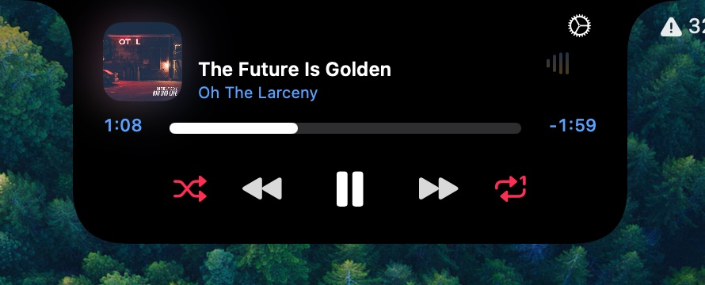
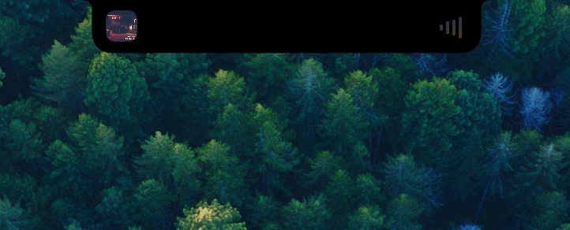

# Here Island

A minimal live activity in your MacBook notch — album art, controls, and a real-time waveform for what’s playing now.

  
   
  

Website: [locusable.com/here-island](https://locusable.com/here-island/)

## What it does

Here Island is a menu bar app that lives in the MacBook notch and shows a compact music player:

- Album art, title, and artist
- Progress and playback controls: shuffle, previous, play/pause, next, repeat
- Real-time waveform while playing
- Media source: **Now Playing** (default, system-wide — including apps like Spotify) or **Apple Music**

Settings live in the menu bar extra: display scope, haptics, launch at login, and media source.

No battery HUD, system OSD replacement, or configurable control layouts — just media in the notch.

## Download

- **[Latest DMG](https://github.com/locusable-studio/HereIsland/releases/latest/download/HereIsland.dmg)** from [GitHub Releases](https://github.com/locusable-studio/HereIsland/releases)
- Requires **macOS 26.0+**

## Build

1. Open `HereIsland.xcodeproj` in **Xcode 26+**
2. Select the **HereIsland** scheme
3. Build and run

## License

GNU General Public License v3.0 — see [LICENSE](LICENSE).

Provenance is recorded in [NOTICE](NOTICE).

## Acknowledgements

Here Island stands on the work of earlier open-source notch projects:

- **[boring.notch](https://github.com/TheBoredTeam/boring.notch)** — the original Bored Team project that pioneered a rich, native notch experience on macOS. This lineage begins there.
- **[Atoll](https://github.com/Ebullioscopic/Atoll)** — Ebullioscopic’s Dynamic Island–style companion for Mac. Here Island is a further modified, minimalistic work derived from Atoll (itself based on boring.notch). We are grateful to the Atoll maintainers and contributors for the foundation this project builds on.

Thank you to everyone who built, maintained, and shared that software under the GPL.
