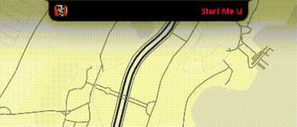

# Here Island

[](https://github.com/locusable-studio/HereIsland/releases/latest)
[](https://github.com/locusable-studio/HereIsland/actions/workflows/release.yml)
[](https://github.com/locusable-studio/HereIsland#download)
[](https://github.com/locusable-studio/HereIsland/blob/main/LICENSE)

A minimal live activity in your MacBook notch — album art, controls, and a real-time waveform for what’s playing now.

<p align="center">
  
</p>

Website: [locusable.com/here-island](https://locusable.com/here-island/)

## What it does

Here Island is a menu bar app that lives in the MacBook notch and shows a compact music player.

**In the notch**

- Album art, title, and artist (title marquee when the name is long)
- Progress with elapsed / remaining time
- Hover to expand for playback: shuffle, previous, play/pause, next, repeat
- Quick peek: title marquee on track change
- Real-time waveform while playing (Appearance → Effects, off by default)
- Album art background and window shadow (Appearance → Effects)
- Accent color: White, Match album art (default), Follow system, or Apple Music

**Hide**

- During screenshots and recordings (off by default)
- When an app is in native fullscreen on that display (on by default). In-page video and zoomed windows do not hide it.

**Lock screen**

- Optional media card on the menu-bar display (Appearance → Lock screen widget, off by default)
- Artwork, title, artist, shuffle / previous / play / next / repeat, progress with times
- Same tint rules as the notch. No waveform on the lock card

**Media and updates**

- Source: **Now Playing** (default, system-wide) or **Apple Music**
- Sparkle: Stable or Beta channel, check for updates
- Launch at login, haptics, display (one screen or all)

No battery HUD, system OSD replacement, or configurable control layouts — just media in the notch, plus an optional lock-screen card.

## Menu

Settings live in the menu bar extra:

- **General:** Launch at login, Haptics, **Hide** (During screenshots and recordings / When fullscreen), Display
- **Appearance:** Quick peek, Lock screen widget, **Effects** (album art background, window shadow, real-time waveform), Accent color
- **Media:** Source
- **Updates:** Check for updates, Channel, Update Settings

## Download

```bash
brew tap locusable-studio/tap
brew trust --cask locusable-studio/tap/here-island
brew install --cask here-island
```

- **[Latest DMG](https://github.com/locusable-studio/HereIsland/releases/latest/download/HereIsland.dmg)** from [GitHub Releases](https://github.com/locusable-studio/HereIsland/releases)
- Requires **macOS 26.0+**

## Build

1. Open `HereIsland.xcodeproj` in **Xcode 26+**
2. Select the **HereIsland** scheme
3. Build and run

## License

GNU General Public License v3.0 — see [LICENSE](LICENSE).

Provenance is recorded in [NOTICE](NOTICE).

## Acknowledgements

Here Island stands on the work of earlier open-source notch projects:

- **[boring.notch](https://github.com/TheBoredTeam/boring.notch)** — the original Bored Team project that pioneered a rich, native notch experience on macOS. This lineage begins there.
- **[Atoll](https://github.com/Ebullioscopic/Atoll)** — Ebullioscopic’s Dynamic Island–style companion for Mac. Here Island is a further modified, minimalistic work derived from Atoll (itself based on boring.notch).
- **[Alcove](https://tryalcove.com)** — lock-screen media panel inspiration.

Real-time waveform capture is adapted from **[rtaudio](https://github.com/ZephyrCodesStuff/rtaudio)** by ZephyrCodesStuff (integrated via Atoll under GPL-3.0 for this lineage).

Thank you to everyone who built, maintained, and shared that software under the GPL.
